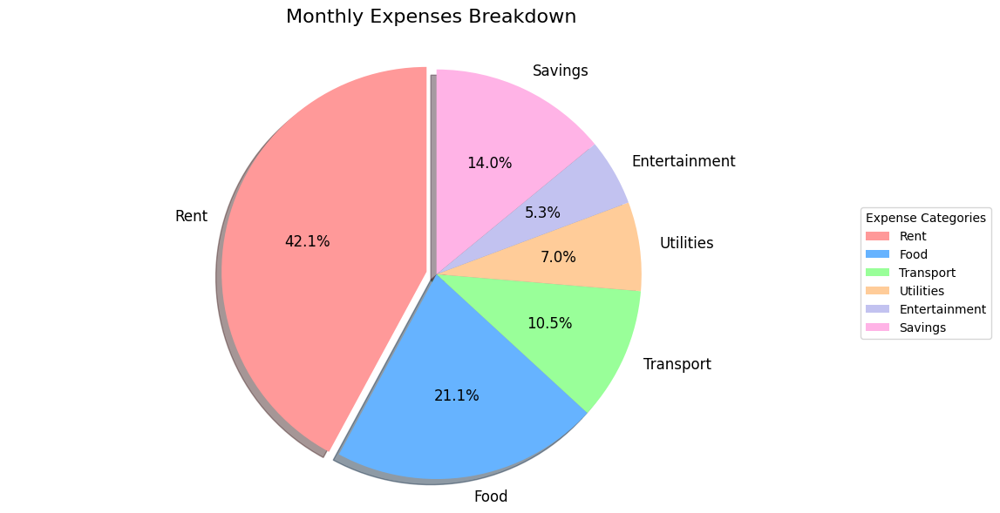

# 💰 Monthly Expenses Visualizer



A Python tool that transforms your monthly spending data into an insightful pie chart visualization using matplotlib.

## ✨ Features

- **Clear Spending Breakdown**: Visualize expenses by category with color-coding
- **Automatic Percentage Calculation**: See exact spending distributions
- **Professional Styling**: Includes shadows, exploded slices, and clean labels
- **Fully Customizable**: Easily modify categories and amounts
- **Export Ready**: Save high-quality PNG images for reports

## 🛠️ Installation

1. Clone the repository:
   ```bash
   git clone https://github.com/Kirankumarvel/monthly-expenses.git
   cd monthly-expenses
   ```

2. Install dependencies:
   ```bash
   pip install -r requirements.txt
   ```

## 🚀 Usage

Run the visualization:
```bash
python expenses_piechart.py
```

Customize your data by editing these variables in `expenses_piechart.py`:
```python
categories = ['Rent', 'Food', 'Transport', 'Utilities', 'Entertainment', 'Savings']
amounts = [1200, 600, 300, 200, 150, 400]  # Replace with your actual amounts
colors = ['#ff9999','#66b3ff','#99ff99','#ffcc99','#c2c2f0','#ffb3e6']  # Optional color customization
```

## 📊 Sample Output
The script will:
1. Display an interactive pie chart window
2. Save the visualization as `monthly_expenses.png`

## 🎓 Learning Outcomes
This project helps you master:
- Matplotlib's `pie()` function
- Data visualization principles
- Financial data representation
- Chart customization techniques

## 🤝 Contributing
Suggestions welcome! Potential enhancements:
- Add input via CSV/Excel files
- Create monthly comparison charts
- Implement interactive hover effects

## 📜 License
MIT License - Free for personal and educational use

---
